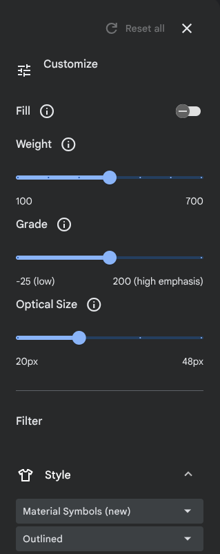

# Introduction to accessing fonts in Rust with Skrifa

Learn to generate an Android [Vector Drawable](https://developer.android.com/develop/ui/views/graphics/vector-drawable-resources)
from a [variable](https://medium.com/variable-fonts/https-medium-com-tiro-introducing-opentype-variable-fonts-12ba6cd2369) icon font.

## Logistics

It is assumed that all code is cloned into the same directory and that [`cargo new`](https://doc.rust-lang.org/cargo/commands/cargo-new.html) is run in that directory.

At times only partial commandline output is given to reduce noise.

## Install Rust

See [https://www.rust-lang.org/tools/install](https://www.rust-lang.org/tools/install)

If you haven't written Rust **at all** so far take the time to complete at least one of:

1. Microsoft [Rust first steps](https://learn.microsoft.com/en-us/training/paths/rust-first-steps/)
   * 0.5 to 1.0 days
1. Google [Comprehensive Rust](https://google.github.io/comprehensive-rust/)
   * 4+ days, can be consumed in small chunks

## Get an editor

[VSCode](https://code.visualstudio.com/) with [rust-analyzer](https://code.visualstudio.com/docs/languages/rust)
is a good default if you don't already have a favorite.

## Get some icon fonts

Clone [https://github.com/google/material-design-icons](https://github.com/google/material-design-icons)

It's big, give it a minute :) In `` you'll find the variable fonts that contain all variants of all icons
shown at https://fonts.google.com/icons. When Style is set to "Material Symbols" The "Customize" options there are actually manipulating the axes of the variable font:



## Generate a Vector Drawable

### Create a CLI tool

```shell
# Create a new binary project
$ cargo new font2vd
     Created binary (application) `font2vd` package
2 directories, 2 files
$ cd font2vd
$ cargo run
Hello, world!
```

**Subsequent instructions assume you are in the root of font2vd**

### Error handling

Let's take this slightly more seriously than [font103](../font103) and try to avoid `unwrap` and `expect` for the most part.

* Add a dependency on [thiserror](https://docs.rs/thiserror/latest/thiserror/) (`cargo add thiserror`)
* Setup an enum for errors encountered producing vector drawables.
   * It can be setup exactly as the `thiserror` example shows, have no entries for now, and be called something creative like `VectorDrawableError`.
* Change your main function to return `-> Result<(), VectorDrawableError>`
   * The compiler will complain, add `Ok(())` as the final line of main
   * Now might be a fine time to read about the [unit type](https://doc.rust-lang.org/std/primitive.unit.html)

Make sure you can `cargo run` before proceeding.

Stuck? See [1-errortype.rs](./1-errortype.rs).

### Command line args

Add a dependency on clap (`cargo add clap --features derive`) and setup an args structure with two arguments:

1. A string that is a position in designspace
   * We'll be using this to construct a [`Location`](https://docs.rs/skrifa/latest/skrifa/instance/struct.Location.html) using [`AxisCollection::location`](https://docs.rs/skrifa/latest/skrifa/struct.AxisCollection.html#method.location)
   * A comma-separated list of axis tag : value pairs could work on the command line
   * Since variable fonts have a well defined default location you could mark it as allowed to default by adding `, default_value = ""`
      * E.g. `#[arg(short, long, default_value = "")]`
1. A path to an icon font
   * We'll be using this to construct a [`FontRef`](https://docs.rs/skrifa/latest/skrifa/struct.FontRef.html)

Try `cargo run -- --help`. It should print help about your commandline arguments.

What's with the `-- --help`? - the stuff before the `--` is arguments to Cargo, after is arguments to your program. See the `cargo run` [docs](https://doc.rust-lang.org/cargo/commands/cargo-run.html#description).

Stuck? See [2-args.rs](./2-args.rs).

### Load the font with error handling

Load the font specified in your args structure into memory, perhaps using [`std::fs::read`](https://doc.rust-lang.org/std/fs/fn.read.html). If that fails you'll get a [`std::io::Error`](https://doc.rust-lang.org/std/io/struct.Error.html). Alas, our `main`
returns `VectorDrawableError`. Add a variant to `VectorDrawableEror` that can hold an io error. It should look like the `Disconnect` variant shown in the [thiserror](https://docs.rs/thiserror/latest/thiserror/) example. Use [`Result::map_err`](https://doc.rust-lang.org/std/result/enum.Result.html#method.map_err) to convert the error type and the error propagation operator [`?`](https://doc.rust-lang.org/reference/expressions/operator-expr.html#the-question-mark-operator) to handle the error.

Try running your program and pointing it at a path you can't read. It should print something akin to:

```shell
$ cargo run -- --pos wght:0 --file not-real
Args:
Args {
    pos: "wght:0",
    file: "not-real",
}
Error: ReadFont(Os { code: 2, kind: NotFound, message: "No such file or directory" })

```

Stuck? See [3-fileerror.rs](./3-fileerror.rs).

### Create a FontRef

Add a dependency on skrifa (`cargo add skrifa`).

Create a [`FontRef`](https://docs.rs/skrifa/latest/skrifa/font/struct.FontRef.html), passing in your data as a u8 [slice](https://doc.rust-lang.org/reference/types/slice.html). `FontRef::new` returns a `Result` with a new error type. You'll have to add a variant to `VectorDrawableError` and use `map_err` again.

Just to confirm it's working you could print the variable font axes by calling [`.axes()`](https://docs.rs/skrifa/latest/skrifa/trait.MetadataProvider.html#method.axes) on your [`FontRef`](https://docs.rs/skrifa/latest/skrifa/struct.FontRef.html) (it helpfully implements [`MetadataProvider`](https://docs.rs/skrifa/latest/skrifa/trait.MetadataProvider.html)). This will give you the axes and ranges declared in the [fvar](https://learn.microsoft.com/en-us/typography/opentype/spec/fvar) table is [user units](https://github.com/googlefonts/fontc/blob/main/resources/text/units.md).

### Set the location in variation space

Parse the String location into the input we need to call [`location`](https://docs.rs/skrifa/latest/skrifa/struct.AxisCollection.html#method.location). Hints:

   * The example input `[("wght", 250.0), ("wdth", 75.0)]` is an array of tuples of `&str`, `f32`
   * `String` has a very nice [`split`](https://doc.rust-lang.org/std/primitive.str.html#method.split) method
      * It gives you an [`Iterator`](https://doc.rust-lang.org/std/iter/index.html) over the results
   * Use [adapters](https://doc.rust-lang.org/std/iter/index.html#adapters) to convert to your desired type
   * [`collect`](https://doc.rust-lang.org/std/iter/trait.Iterator.html#method.collect) the result into a [`Vec`](https://doc.rust-lang.org/std/vec/struct.Vec.html)
   * [https://doc.rust-lang.org/rust-by-example/error/iter_result.html](https://doc.rust-lang.org/rust-by-example/error/iter_result.html) gives examples of handling errors with iterators

It might be worth iterating on. Writing a for loop over the split and push results into a mutable vector might feel natural
depending what language(s) you are most familiar with.

Print the debug representation once you have parsed the location. It should look something like this:

```shell
$ cargo run -- -p wght:100,FILL:0.75 -f ../material-design-icons/variablefont/MaterialSymbolsOutlined\[FILL\,GRAD\,opsz\,wght\].ttf
Args {
    pos: "wght:100,FILL:0.75",
    file: "../material-design-icons/variablefont/MaterialSymbolsOutlined[FILL,GRAD,opsz,wght].ttf",
}
Location { coords: [0.75, 0.0, 0.0, -1.0] }
```

Note that Location is in [normalized units](https://github.com/googlefonts/fontc/blob/main/resources/text/units.md).

Stuck? See [4-split.rs](./4-split.rs).

# TODO: finish me :)